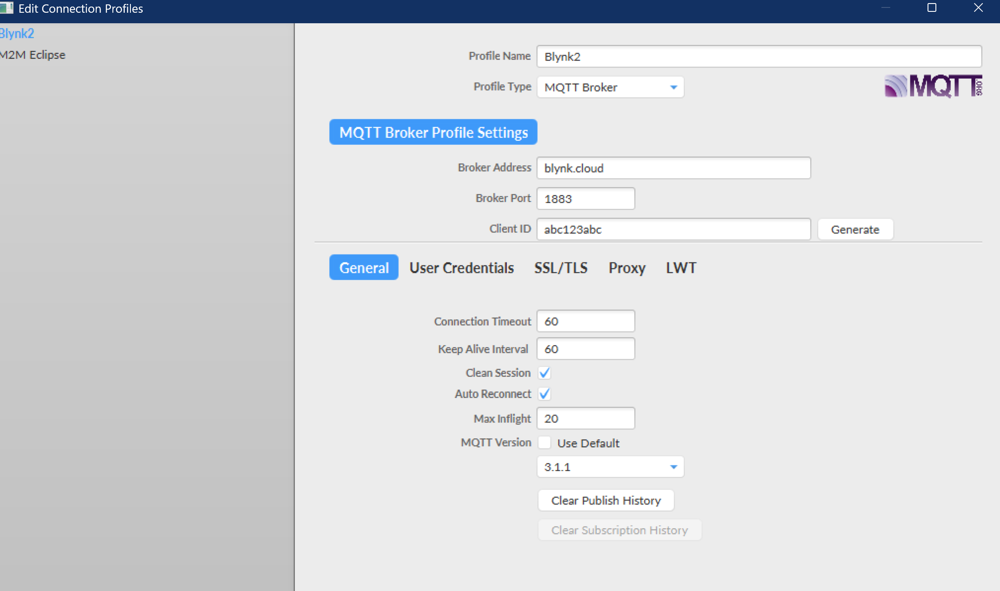
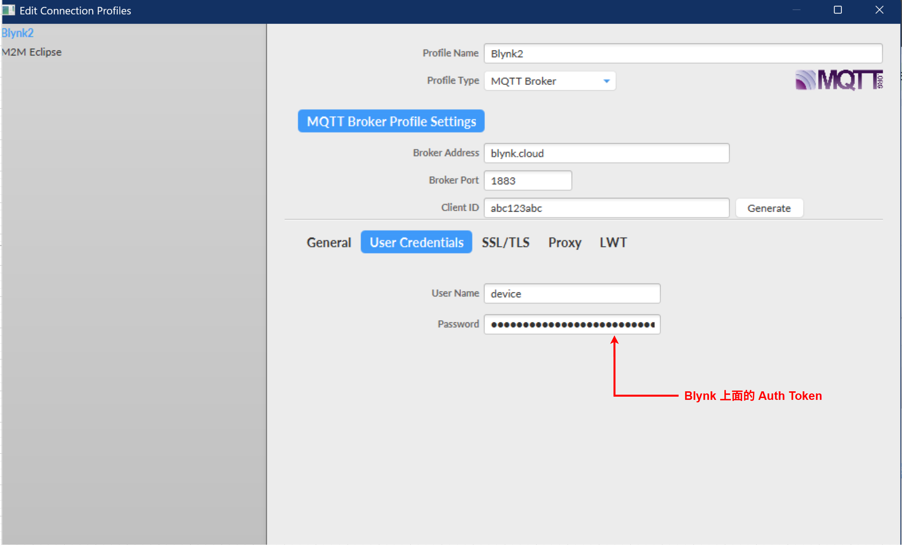
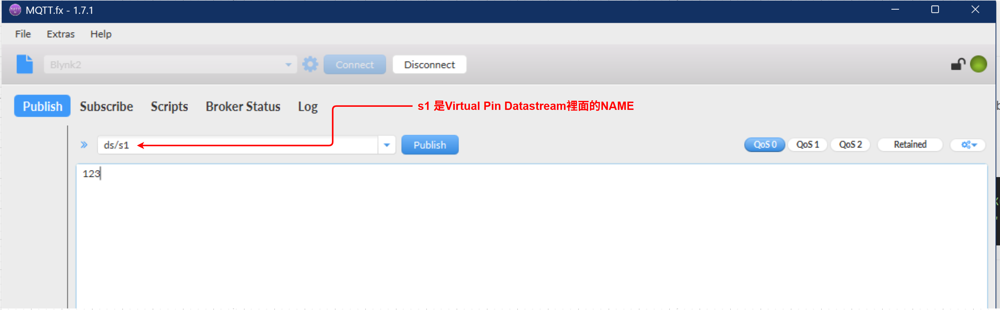

Profile Name: 名稱自定  
Profile Type: MQTT Broker  
Broker Address: blynk.cloud  
Broker Port: 1883。 //1883 基本的 MQTT 連線，沒有加密，純粹傳輸純文字資訊。  
`                 `//8883 在連線中加入 TLS/SSL 加密層，確保資料傳輸的私密性和完整性。  
Client ID:名稱自定  

User Name : device //Blynk指定 用device這個名稱  
Password : Blynk上面每個device生成的 Auth Token  
Keepalive: 45 seconds (recommended)  
Clean Session: True  

Topic: ds/s1, s1是Blynk 裡面Datastreams Name的名稱，不是pin的名稱。  
Payload: 直接輸入數字  

  
  
  
