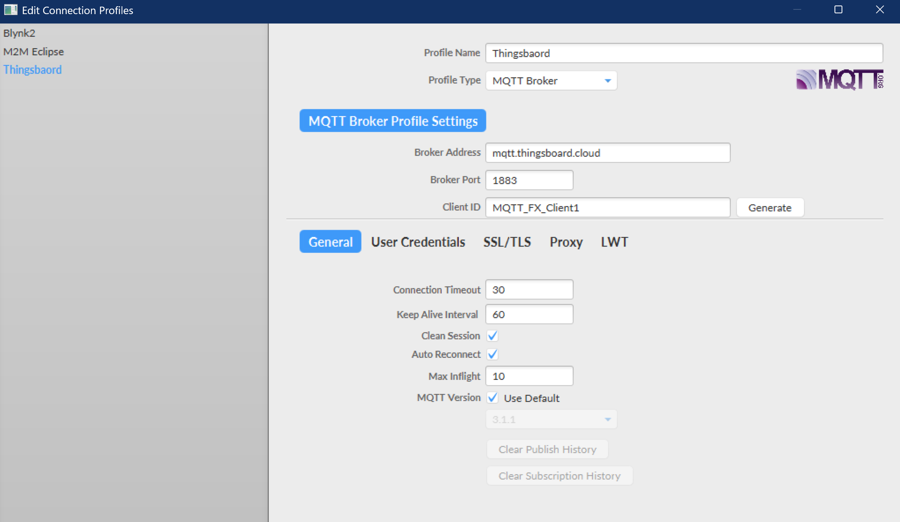
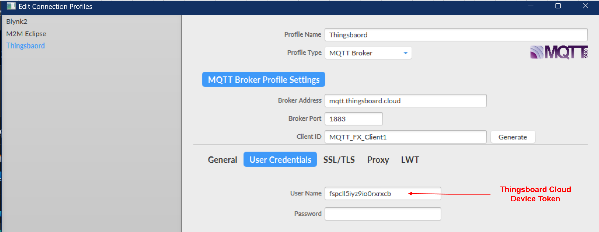

# ESP32_Thingsboard_IOT

2025.10.15  
舊案原本用H牌mcu 控制設備，並把設備數據發送到Thingsboard Cloud, 新案打算做一些改變。  

原因:  H牌mcu 僅是供基本範例程式，進階應用、IOT應用 需自行摸索 建立。  
`    `所以改用ESP32開發板，範例多包含相關IOT應用都有，網路資料多 遇到問題也方便查詢，  
`    `雲端IOT 改用Blynk，費用較低 而且手機app畫面 較為舒適，  
`    `因為此案的IOT沒有要高階使用，只是簡單的觀看設備狀態、數據 一些基本功能所以選擇Bynk.   

專案學習計畫 [研發_第一階段](Files/研發_第一階段.png)  
`            `[研發_第二階段](Files/研發_第二階段.png)  
`            `[研發_第三階段](Files/研發_第三階段.png)  

用ESP32 跑範例程式，發現 有連線 ，但數據傳不上去，所以先把問題收斂 先做最小功能。
先用MQTT.fx 工具測試上傳數據到Blynk 是否正常，相關範例可以參考[MQTT.FX_上傳到Blynk](MQTT.FX_上傳到Blynk.md)

Blynk 的OTA功能，就算是付費版 也有次數的限制(25次)，  
建議用專用USB燒錄工具的簡易一鍵更新程式，利用Python或C#寫一個GUI應用，只要點更新就負責呼叫底層燒錄命令。
CSV, GPS定位 免費版本都不能使用，付費才有  
Blynk網頁 沒辦法直接分享出去。需要其它用戶、訪客 也註冊Blynk  才能看到 我做的網頁。
這樣做安全性 是比較好，但要推廣介紹 比較麻煩。也可能是習慣問題 之前都用Thingsboard.  
Blynk平台...先暫緩，變更研發方向 ESP32 To Thingsboard  

========================================================================================  
2025.10.16  
筆記1.單人開發且產品會有商業應用，使用 Access Token 就好。  
`    `如果我的設備有問題 一直大量丟資料到thingsboard cloud，為了避刷thingsboard cloud平台流量被限制，  
`    `我可以透選改這個device token方式 來拒絕接收數據。等把設備搞定了，再把device token 改回來原本的。   
筆記2.使用 SSL/TLS 加密確實會讓每次上傳的數據量變大一些，這是加密通訊的正常現象  

MQTT.fx上傳數據到Thingsboard Cloud  
  
 
